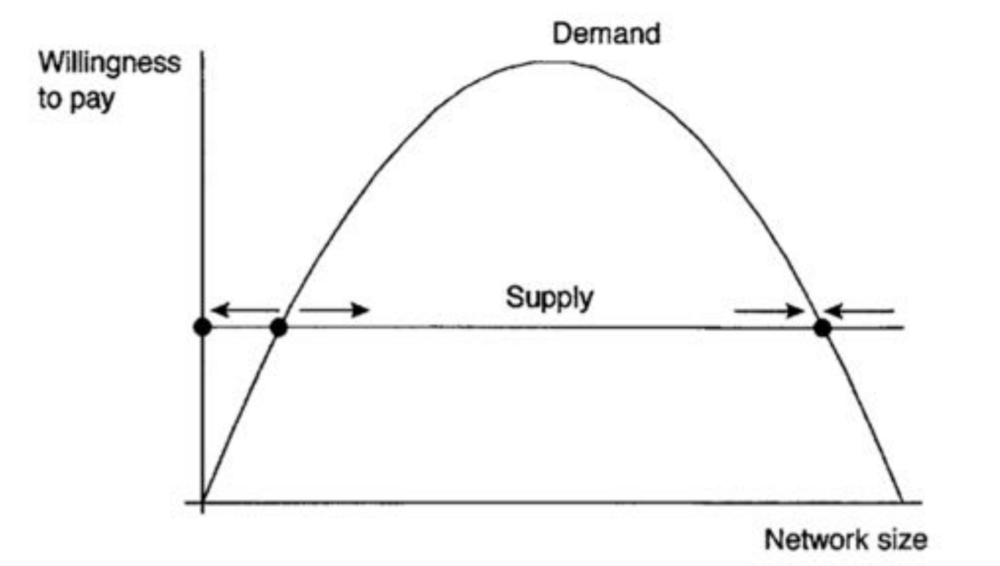

# Determining price

## Demand

- **Demand** = consumer willingness to pay a price.
- **Market demand** = total of what everybody in market wants.
- Each consumer has a **private valuation** of what prepared to pay.

### Non-price factors

- Advertising
- Market size
- Demographic population
- Seasonality
- Income
- Complementary goods
- Subsitute goods
- Expectations
- Legislation

## Supply

- **Supply** = supplier's willingness to sell at a given price
- **Market supply** = total quantity of G+S that is available to customers at given price
- Each supplier has a **private valuation** of what prepared to sell at

### Non-price factors

- Costs of factor inputs
- Production technology
- Expectations of future prices
- Substitute goods price (opportunity cost)
- number sellers in market
- Legislation

## Equilibrium Price

In idealised market, expect Q sales at price P where Q,P is equilibrium price.

**Partial equilibrium model**: idealisation of a market for one product.

## Utility/Profit

**Utility** = difference between private valuation and market price

- Demand: If market price > private valuation, consumer will not purchase.
- Supply: If market price < private valuation, supplier will not supply.

# Internet Economics

> "Technology changes, economic laws do not"

Digital goods and internet transformed business landscape.
-> the underlying economic forces manifest in new ways.

But, underlying forces have not fundamentally changed. Understand the forces => understand how apply in new situations => guide action in digital economy.

## Combinatorial Innovation

> "“A technology whose rich set of components can be combined and recombined to create new products/services"

Initial success breeds more success:

- Demand: social interta to new ways of doing things are overcome, customer move on
- Supply: innovators experiment with set of components and develop new ways of using them
- Development of components, interchangeable parts, standardisation

## The Internet Revolution

Combinatorial innovation now new: eg gears, pulleys, chains -> revolutionised manufacture

But, internet revolution is a lot quicker, due to **ease of access to innovators**:

- cheap supply and training costs -> low barrier to entry
- innovations are rapidly distributed globally
    - ideas shared more easily
    - standardisation easier and more necessary
- increasinly, innovations are open source -> easy to build on top off

> "Open source software is the primordial soup for combinatorial innovation." ~ Varian

## Online economic activity

Four different interconnected activities

1. **Digital goods** - delivered online, but used locally. eg mp3, software.
2. **Information goods** - value of good is info in provides. eg news website, stock exchange data feed
3. **Online purchasing of physical goods** - eg amazon books, moving b2b supply chain online
4. **Online provision of services** - eg Spotify, kashflow

## Differences between physical and digital technology

The different characteristics of digital technology as compared with physical technology impact its economics.

- Digital goods costly to produce, cheap to reproduce. *Fixed costs* high, *variable costs* low.
- Most production costs are *sunk*.
- No *capacity constrains* limiting number of times something can be reproduced.
- Digital goods are often *experience goods* (consumer doesn't know value without actually using them).
- *Positive network externalities (**The network effect**)* often strong.
- *Search costs* for consumer often low.

### Effect on competition

Competiting companies, near zero zero variable, identitical products => competition drives price to zero.

This risk means that new companies wont want to compete with existing company because setup costs high compared with possible profits.

For commodity digital goods, there is tendency to *monopoly and/or zero pricing*.

Companies must therefore focus on product differentiation, or competing for emerging future monopolies.

### Disintermediation

In the dotcom boom, it was predicted that small businesses would no longer need intermediaries to sell their products and services (as cost of reaching customers directly online be dramatically less).

But, as cost of reaching customers decreased, the cost of attracting customers (getting people's attention) increased.

**New kind of intermediary emerged: online marketplace**. (ebay/amazon).

- A single site to access and trade with many sellers
- mechanisms to help assess trustworthiness

### Price Discrimination

**Price discrinimination**: seller charges buyers at different prices, depending on their willingness to pay.

- *1st degree*: different price for each buyer. Difficult in physical goods, easy online.
- *2nd degree*: offering different product 'versions' at different price points.
- *3rd degree*: offering different prices to different groups of customers.

#### 1st Degree Price Discrimination

- Seller wants to extract entire consumer surplus from each individual consumer.
- Seller cannot know each consumers private valuation, but data about past behaviour can be used to estimate it!

- Sep 2000: Amazon accused of doing this. Delete cookies -> different prices.
- Amazon claimed simply changing prices very quickly as an experiment.

##### Dynamic Pricing

- use customers browising history and geolocation to vary offers and products displayed
- travel side Orbitz: accused of charging more to visitors from macOS.

#### 2nd Degree Price Discrimination: Versioning

- Offer customers different versions to help them reveal their willingness to pay
- Commonplace in the physical world: eg car models, hardpack vs paperback books.
- Digital versions are:
    - easier to prepare than physical versions: simply cut down functionality of the full version
    - near-zero cost to duplicate
- Because of this, versioning used extensively in digital economy:
    - try before you buy
    - free (lite) versions (limited functionality)
    - pay for no ads
- these allow customers to build a 'true valuation' of a product. People value something more when they have it than when they don't. Particularly useful for 'experience goods'.
- Free versions very important for building 'network effect'.

**Economic rule for consumer behaviour**: Consumer will purchase the version that maximises their net utility (private valuation - real price). If versions have same net utility, they will purchase the best version.

##### Competing against yourself

Versioning risk: people willing to pay for higher price may go for the lower price version. Choosing price points and functionalities is critical for business.

#### 3rd Degree Price Discrimination

Sell at different prices to different demographics: based on age, location, time of day, business customers, students, etc.

Common in physical world:

- student discount on train fare, software licenses, shopping, ...
- OAP discount on cinema tickets
- Business commuters have peak-time rail fares
- etc

Similar models online:

- student/academic software versions
- premium business versions

#### Personalisation

**Personalisation**: creating version for each individual customer: versioning but at almost 1st degree price discrimination.

People tend to 'upsell' towards almost-top options when offered with different options.

#### Bundling and Unbundling

 **Bundling**: selling number of products/services together for a single price.
 
 E.g.: MS Office, Google Apps for Business, a music CD, a newspaper (bundles information and entertainment).

Like versioning, is used to sell more to customers who would otherwise not purchase.

It reduces *dispersion of willingness to pay*: a form of price discrimination, i.e. makes the demand curve flatter.

Economics of bundling:

- if willingness to pay is negatively correlated (i.e. consumers value different products in bundle with opposite order of preference/valuation) -> bundling is particularly effective
- But Law of Large Numbers -> unless values are perfectly correlated, summing them will tend to reduce dispersion.

- Bundling especially effective for information goods (whose market value derived from information is contains, e.g. CDs, DVDs, books): zero marginal costs

- Bundling introduces barriers to entry: a competitor wishing to compete directly must offer all products in bundle. This dramatically increases fixed development costs.

##### Digital Bundling/Unbundling

- Digital goods have extremely low variable costs -> bundling cheap to perform
- No physical substrate needed online, there is less commercial pressure to bundle -> newspapers, CDs, etc can 'unbundle'.
- This can reduce profit overall, but also introduce competition for parts of the bundle.

###### Unbundling of news

- Headline news is cross-subsidised: business, sports, travel, home, gargen are where money is made as easier to target advertisements in these areas.

- People value news and do access it, but, in an 'unbundled world':
    1. news cannot be cross-subsidised by other parts
    2. raw news is a commodity, so competition drives prices to zero
- this is challenge for news industry.

### The Network Effect

- A *network externality* is a particular kind of externality.
    - can be negative (buying car -> pollution) or positive (buying car -> more petrol stations)

- Positive network externalities are are common and extreme in online:
    - ms office
    - ebay provider rating
    - forums
    - social networks
    - multi-player games
    - paypal accounts

Start of curve:
- **penetration pricing**
- Early adopter will have a low valuation, so must charge less to build the network.
- The nature of digital goods/services gives new ways of doing this.

##### Building the network

###### Use of free versions

Dupliates of digital goods almost zero cost to provide: can be given away for free. E.g. Adobe Reader for free adds value to network of Adobe Acrobat users.

##### Freemium

Freemium business model is to offer different versions at different prices, including a free one.

Converting free to premium:
- encourage consumer to invite friends/colleagues: builds the network
- this builds the part that is most valuable to consumer -> network increases, private valuations increase
- hence, consumers become willing to pay a price for premium version
- -> reaching this *critical mass* in network is essential

