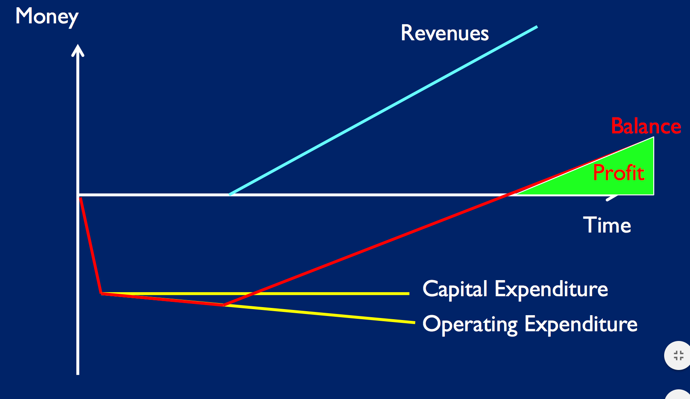

# Cloud Computing

Once-a-decade 'revolution:

- mainframes
- minicomputers
- micros/PCs
- LAN/distributed
- internet/web
- Utility/service

## Basic Economics of Cloud

### Running costs

#### Normal Failure

- Say servers have 99.999% (5 9's) reliability (3 year survival rate)
- 10 servers -> probability 100% of servers working 3 years later = 99.990%
- 50k servers -> 61%
- 500k servers -> 1%

## SaaS, Paas, IaaS

SaaS:

- End-user app remotely delivered over internet/web

PaaS:

- Developer application software (middleware) functionality, remotely accessible
- E.g. provide typical combination of OS, web-server, database & scripting
- E.g. LAMP stack = linux, apache, mysql, php/perl/python
- Google App Engine
- AWS Appstream, (DynamoDB), Elastic Beanstalk

IaaS:

- IT infrastructure, almost always virtualised, remotely accessible, "bare metal"
- virtualisation software allows one physical server to be used by multiple users, each on a virtual machine - if one VM crashes, the others keep running
- AWS EC2, S3, SQS
- Google Compute Enging

## Monster Muck Mashap

Scale out, not scale up architecture.

## Interoperability

Open cloud manifesto - not adopted by Amazon, Google.
