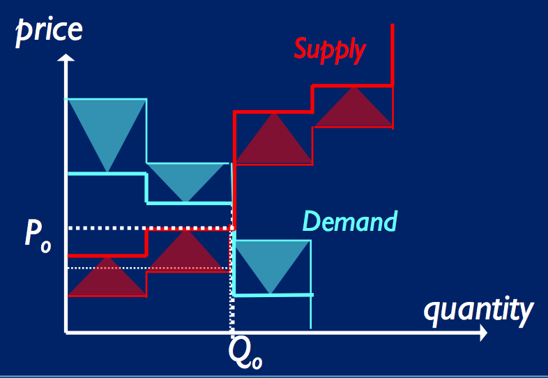

# Economic Agents and Market-Based Systems 1

## Why econ and CS

- Market econ is an important metaphor for new methods in CS/engineering dealing with allocation of scarce resources
    - Market-based control (MBC) or M-B resource allocation (MBRA)
    - gives fast, robust, distributed control for dynamically varying problems

Requires software versions of:

- traders (quoting prices, haggling)
- marketplaces (where buyers and sellers meet and interact)

Designing traders and marketplaces is hard, but can be done automatically.

Innovations in CS of computer models / implementations of traders and market mechanisms can lead to innovations relevant to real-world economic/financial systems.

## Economics: Dismal, but necessary

There are lots of important resource limited systems:

- telecoms, computer OS, logistsics, staffing/timetabling, IoT ...
- automating their control/regulation is attractive and difficult
- ideas from microecon can help us do automated dynamic resource allocation and control in *engineered* systems
- MBC is not a radical new idea, initially explored in late 90s (Huberman, Clearwater (market based aircon system))

## On the trading floors

- These automatically-optimized robot traders and market mechanisms, originally intended for control of data centers, are of significant interest to major investment banks, buyside funds, exchange operators

# Background Economics

- **Sellers' market**: demand exceeds supply -> shortage -> price rise
- **Buyers' market**: supply exceeds demand -> surplus -> price drop
- -> *price is function of quantity demanded and quantity supplied

## Free markets

- Free markets are **self-correcting**: price/quantity converges towards **competitive equilibrium**, until supply/demand shocks
- The market mechanism gives an efficient allocation of resources without a central controller or external intervention. A common measure of efficient allocation is **Pareto Efficiency**.
    - allocation is Pareto Efficient if no-one can be made better-off without someone being made worse-off
    - Pareto efficient allocations can arise from free markets despite the fact that each trader in the market is acting only to serve his or her request (*its an emergent property of a decentralised system*)
    - -> the traders appear to be led by an *invisible hand*...
    - Free markets no guarenteed to achieve optimal allocations: conditions in which they definitely fail are well known (e.g. monopoly)
    - free market pareto efficient allocation is not necessarily equitable

### Auctions and traders

**Auction**: mechanism by which buyers and sellers come together to agree price to a trade

- english auction
- dutch auction
- retail auction (posed offer)
- CDA

**Continuous Double Auction:**

- Traders in a CDA deal with noisy asynchronous data from multiple sources and must react in real-time to maximise their utility
- Classical microecon theory breaks down when we try to analyse CDA markets
- Without any central control or coordination (eg auctioneer), human traders actingly in self interest in a CDA rapidly and reliably converge on the markets theoretical equib price
- May be public time limit until market closes

## CDA Realities

##### 1. Stepped supply and demand curves

- supply and demand curves may be stepped (relatively small number of individual units)
- each step in supply curve represents an additional unit available for sale at the indicated price
- each step in demand curve represents an additional unit desired at the indicated price
- each step is an absolute limit for agents:
    - for seller: below line they will not sell
    - for buyer: above line they will not buy

##### 2. Theoretical and _apparent_ supply and demand curves

- **Utility** = difference between trader's limit price and transaction's real price.
- **Percentage profit** = **margin (on the deal)** = utility as percentage of limit price.

- Real supply/demand curves are obscured as sellers/buyers quote prices different to their private limit prices to try and increase their utility.
- -> **apparent** supply and demand may be very different: giving different P_0 and Q_0.



- Shaded traingles represent *utility margins* which traders are trying to trade at
- horizontal edge of each triangle rests on *limit price* of each trader, defining that step of the theoretical supply/demand curve
- apex of triangle points to *price+margin* which is the value that trader actually quotes in market at any one time.
- traders in auction can only observe the quoted prices, none know the actual hard limit prices, as they're private

- intersection of the apparent demand/supply curves may indicate a very different equib price
- **yet traders in CDA discover true underlying equib price without central coordination**

##### 3. _Dynamic variation_ in supply and demand curves

- Whenever a transaction is made, the involved buyer and seller withdraw from the market -> the curves are updated
- Therefore, we write `P_0(t)` and `Q_0(t)`
- Small number of traders -> one transaction can lead to relatively big changes in supply/demand
- This happens after every transaction, plus in a real market new sellers and buyers can enter at any time

##### 4. Target margin of each trader is changing

- If you're rational/intelligent trader (human or AI), you adjust your margin to the current conditions of the market.
- -> Traders margins are constantly changing in reaction to what they observe in market, even if the underlying curves are the temporarily constant
- Even without transactions, traders dynamically alter their margins

Typically what happens:

- those traders whose limit prices are favourable in comparison to equib price, capitalise on this by increasing their margin (towards equib price)
- those traders whose limit prices are 'wrong' side of equib price, forced to reduce their margins (towrds equib price) in attempt to secure a trade

## Experimental Economics

- Pioneered by Vernon Smith.
- Laboratory-style studies of human market-trading behaviours
- Small numbr of human subjects split into "buyer" and "seller" groups
- All traders given a private-value limit price
    - buyers given sums of cash; can't buy above limit price
    - sellers given units of arbitrary commodity; can't sell below limit price
- traders interact within some market mechanism
    - buyers quote bid prices
    - sellers quote offer prices
- demonstrated rapid equib in CDA with small number of traders
- professional traders tend to do only slightly better than naïve subjects: intelligence is in the market?

### Vernon Smith's Results

Human traders results (i think humans?)

- Symmetric supply/demand: over trading periods, prices converge to equib price
- Perfectly elastic supply: prices start above equib and move towrds equib price, but remains above equib price for entire experiment


#### Metrics for Markets

- **Smith's alpha** - root mean sq deviation of transaction prices around the theoretical equib price, expressed as a percentage. (e.g. std deviation round equib price instead of mean, expressed as percentage)
- so, lower is better

```
alpha = 100/P0 \* sqrt[ sum_t[ (Pt - P0)^2 / size(T) ] ]
```

- **Allocative Efficiency** - total utility earned by all traders, divided by the theoretical maximum possible total utility (surplus), expressed as a percentage.
- measures how effective the market is at extracting 'gains through trade'

- **Single Agent Efficiency** - profit earned by an agent, divided by its expected profit if all trades take place at the equib price: measures how well an *individual agent* performs

- Allocative efficiency (of a market) can never be greater than 100%, but single agent efficiency can

### Gode & Sunder '93 ZI Agents

- Gode & Sunder '93 introduced ZI trading agents for CDA markets
- Explored: How much of the (allocative) efficiency of a CDA is due to the intelligence of the traders, and how much due to the organisation of the market?
- **ZI-U**: unconstrained: generate uniform random bid/offer quote prices
- **ZI-C**: random quote prices, but constrained not to trade at a loss
- A transaction occurs if current quote price cross last quoted price from counter party side
- Ran experimental economics tests with ZI-U, ZI-C and human traders in 5 different markets, monitored their allocative efficiency
    - ZI-U traders useless
    - ZI-C traders suprisingly human-like
- Conclusion: **most of the intelligence is in the market, not the traders**. (or allocative efficiency not good measure?)


#### Results

- Humans: quickly converge to theoretical equib
- ZI-U: random, useless
- ZI-C:
    - within each trading day, they converge to the equib price.
    - though, no improvement over successive days, but this is what we would expect as they dont learn anything. 
    - resulting allocative efficiency comparable to that of humans

    
