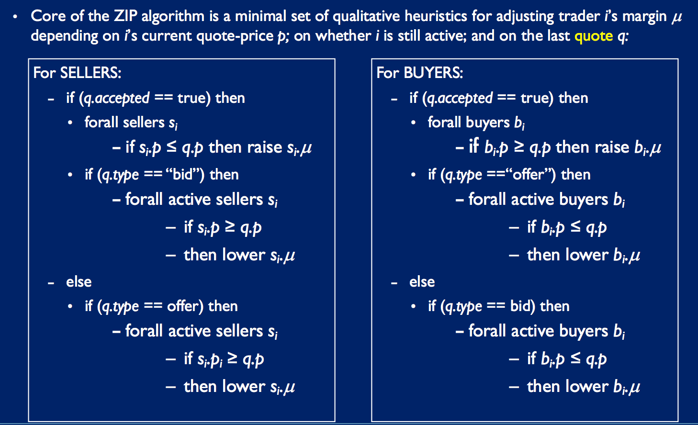
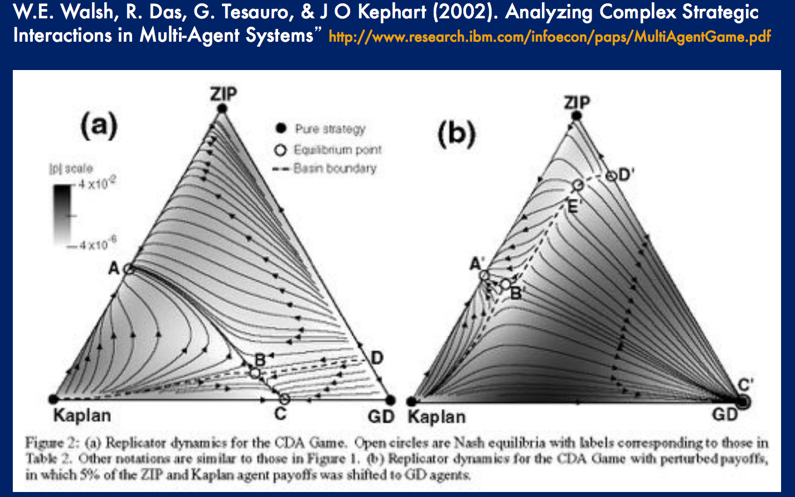

# Economic Agents and Market-Based Systems II

# Dave Cliff HP Labs Technical Report 97 summary

Critique of Gode & Sunder 93

- analysed PDF of ZI traders and proved G+S results wre artefactual
- predicted conditions when ZIC traders would fail to equilibrate
- implemented ZI-trader system to empirically demonstrate failures predicted by analysis

Developed ZIP trades

- have a profit margin, which they adjust using learning rule
- demonstrated to succeed in markets where ZICs fail
- human-like market dynamics in CDA and retail auction

ZIP has become de facto benchmark for assessing algo traders.

# Critique of ZI-Cs

- Sellers: Pmax and Smin determine PDF over quoted prices
- Buyers: Dmax and Pmin determine PDF oover quoted prices

- Trade occurs in ZIC market only if a buyers bid price is greater than a sellers recently quoted offer, or vice versa (*crossing the spread*)

- So, PDF of transaction prices is given by overlapping area of bid (buyer) and ask (seller) PDFs

- If symmetric supply and demand curves,
    - i.e. approx equal gradient in magnitude but opposite sign
- then expected transaction price `E(p)` is close to the equib price
- -> The pdf is summetric about its peak, and peak is set by equib price

## When Supply/Demand not symmetric

- In situations where transaction-price pdf is not symmetric about the peak determine by quib price, the expected transaction price `E(p)` will differ significantly (and predictably) from the equib price P0
- These analytically predictable failures to equilibrate have been demonstrated to occur in replications of G&S's experiments, using supply and demand schedules such as this (similar to one of Smith's shown earlier) where `E(p) != P0`, ***so we need a better trader than ZIC***
- D Cliff reports show this: G&S results cannot generalise to assymetric demand gives

# ZIP Algorithm

- For sellers, you have a thing to sell and a limit price `L` (specified externally: by experimenter or in real world, by client order).
- Profit margin `M` randomally initialized for each trader, but remains private
- Price you ask, `P = (1.0+M)L`
- If you have a thing to sell, and current proposed price is P and either:
    - sellers accepting bids below P; or
    - sellers making offers below P
-   then decrease M (but not below zero)
- If trades at happening at prices above P, then increase M (even if currently have nothing to sell)
- The buyers do the inverse of this
- Amount by which you adjust your profit margin M is determined by a learning rule (Widrow-Hoff with momentum)
- So, ZIP is adaptive - adjusts behaviour according to other traders' actions



## Quantitative margin adjustments

ZIP algo is adaptive: adjusts margins up or down using simple ML rules

Quote-price `p_i(t)` set by *limit price* `λ_i` and margin `μ_i(t)`:

```
p_i(t) = λ_i \* (1 + μ_i(t))
```

- Seller:
    - margin always in [0,inf]
    - increasing `μ_i(t)` raises margin
    - decreasing `μ_i(t)` lowers margin
- Buyer:
    - margin always in [-1,0]
    - increasing `μ_i(t)` lowers margin
    - decreasing `μ_i(t)` raises margin

- Amount by which margin raised or lowered by is determined by:
    - a target price, determined stochastically
    - a learning rule, adjusts profit margin towards target price

- **ZIP adds to Widrow-Hoff rule a momentum factor which dampens down responses to high frequency changes in the target price**

## Results

- ZIP converges on equib prices where ZIC traders cant
- ZIP converges when there is sudden step change to equib price (market shock)

### Better than humans

- IBM tested trader-bot algos: ZIC, ZIP, Kaplan's Sniper, GD
- Pitted human traders against trading agents in experimental econ lab
    - (G+S only explored all human or all ZIC markets)
- Both ZIP and GD beat humans
    - both above 1 average efficiency; humans 0.876

# ZIP and further algos

- 1991/3: Kaplan Sniper
- 1993: G+S ZIU/ZIC (G+S)
- 1996/7: ZIP (Cliff, HP)
- 1996/7: GD (Gjerstad & Dikhaut, GD)
- 2001: MGD (Tesauro & Das, IBM)
- 2002: GDX (Tesauro & Bredin, IBM)
- 2006: AA (Vytelingum)

## Todd Kaplan's "Lurking Sniper" Trader

- Algo entered to trading-agent contest
- Outperformed all others (including v complex ones)
- Simple:
    - simply does nothing, only observes transactions, *until*
    - bid-offer spread drops to a sufficiently small value, or
    - offer is less than smallest transaction price in previous period, or
    - there is not much time until market closes.
    - if any of these conditions met, the trader 'snipes' the deal as long as deal makes sniper profit above min threshold

- Too simple?
    - doesn't adapt to market activity
    - unable to infer the market's P0: will snipe any deal however far from equib
    - the free-ride on goodwill of other traders: *are useless if in market filled with just other snipers*

## GD

- Computes a **belief function** using data for recent market activity: calculates the belief function from a history H of  n recent trades.
- Trader's belief fn estimates the probability, for each possible bid or offer price, that a bid or offer would be accepted at that price

```
f(p) = (  able(p) + ole(p)  )   /   (  able(p) + ole(p) + rbge(p)   )
```

where for a given price `p`:

- `able(p)` is number of accepted bids `<=p` in H
- `ole(p)` is number of offers made `<=p` in H
- `rbge(p)` is number of rejected bids `>=p` in H

## MGD (Modified GD): GD for Limit Order Book (LOB)

- GD interpolates to smoothe the fn for prices that do not occur in the history list, using cubic splines
- Chooses a quote price that **maximises the trader's expected gain**: simple product of utility gain (profit) from trade at price and probability of acceptance at the price
- MGD modifies this so that belief fn is forced to show zero prob of acceptance for bids lower than the previous lowest price and for offers higher than the previous highest trade price - this reduces volatility

## How to statistically compare traders

 **Analytical attempt**: is to provide game-theoretic understanding of capabilities of algos such as ZIC, KSniper, etc. It is typically either:
 - impossible
 - so difficult may as well be impossible
 - requires so many simplifying assumptions that end conclusions not relevant anymore

Instead, we do **empirical studies**. For this, we need to know **Design of Experiments (DoE)** and **Visualitzation and statistical analysis of results**.

### Homogenous/Hetrogeneous markets
 
 - There are some applications where studying markets **homogeneously populated** by specific trader algorithms makes sense
    - vary trader algo but keep constant the market's supply/demand schedules and/or dynamic changes in supply/demand
    - such a plausible allocation is MBRA (market-based resource allocation)
- **For other applications (incl. financial markets) homogeneity is implausible**
- But, initial publications on early algos eg ZIP/GD only showed homogeneous experiments

#### Agent-vs-Agent Trading Contests: IBM (Tesauro & Das 2001)

Tested populations of trading-agents using pairs of algos chosen from ZIC, Ksniper, ZIP, GD, MGD in real-time market experiments where traders had to trade multiple units with different limit prices. To do this, they suggested modifications to ZIP and GD:

- GD -> MGD
- ZIP modifications very minor

They performed:

- **homogeneneous populations tests** for validation/reference
    - earlier results for ZIP and (M)GD were from homogenous populations
    - also established baseline performance metrics

- **one-in-many tests**: one trader switches strategy. If it does well, more and more traders defect too.
    - explores vulnerability to defection/invasion

- **balanced-group tests**: buyers and sellers evenly split between two types of agent.
    - every agent of one type has counterpart of other type with identical limit prices
    - they argue this is fairest way to test two algos against eachother


##### Homogeneous population results
 
- ZIC: as before
- KSniper: nothing happens until end, where goes crazy
- ZIP, MGD: convergence within each period

##### One-in-many results

- Defecting to ZIC (from any strategy) reduces efficiency
- Switching to Kaplan's only improves efficiency if in homogeneous market of ZIC, else improves efficiency
- ZIP: Switching always better, unless in homogenous MGD traders
- GD: only improves over ZIC
- MGD: improves over all others, except ZIP

##### Balanced group tests

- ZIP beats GD, Kaplan, ZIC
- MGD beats ZIC, Kaplan, ZIP

##### Conclusions

- Kaplan only good if it is small proportion of trader population (relies on others to equilibrate)
- ZIC dominated by ZIP and MGD
- Other, no consistent winner: best strategy depends on strategy chosen by test of agents

##### Replicator Dynamics

Further work by IBM: **replicator dynamics**:

- 3 strategies in one market (of any ratio).
- Games where agents change strategy over time (change to strategy if it does consistently better)
- identified attractors and fixed points in the resulting dynamic system. 
- after repitions, what ratio of strategies to traders converge to? 
- technique borrowed from evolutionary biology

Results are plotted on a simplex.



Consider Left simplex:

- Each point in the simplex space represents a particular ratio of ZIP:GD:Kaplan
- Vertices of simplex: all traders playing ZIP, GD or Kaplan (homogeneous)
- Middle of edges of simplex: 50:50:0 ratio
- Points inside simplex: a:b:c ratio where a,b,c > 0, for all possible ratios
- Each player may occasionaly and dynamically switch to another strategy, if its generating more payoff than the current strategy
- Curved flow indicators indicate the transition paths the system takes as it approaches various equib points
- Gray scale shading: average speed of transition flow along those vectors (darker=faster)
- Open circles: Nash Equilibria for the system. **Nash Equilibrium is where no player can increase payoff by unilaterally changing strategy, assuming the strategy-choices of the other players stay the same.**
- Point B is an unstable equilibria
- Points A and C are stable equilibria
- So, left hand figure says:
    - A market which starts with ZIP, GDP, Kaplan traders in *any* ratio a:b:c, will, after enough iterations of the replicator dynamics system, converge on a stable mix of strategies which is either:
    - Point A: 60% Kaplan, 40% ZIP; or
    - Point C: 70% GD, 30% Kaplan

## GDX: Tesauro & Bredin, IBM, 2002

- Subsequent to above paper, a final paper released by IBM
- Used **real-time dynamic programming** to formulate agent bidding strategies in a broad class of auctions characterized by sequential bidding and continuous clearing.
- States are represented primarily by an agent's holdings, and transition probabilities are estimated from the market event history, along the lines of the GD "belief function" approach
- GDX beats ZIP in robot-vs-robot studies
- > "We suggest that this algorithm may offer the best performance of any published CDA bidding strategy."

## Adaptive-Aggressive Algorithm, Vytelingum, 2006

- Uses past history (weighted moving average of previous trades) to estimate current market equilibrium price P0, Smith's alpha to estimate volatility
- Uses P0 to determine whether current order is intramarginal/extramarginal
- Based on these + its current level of *aggressiveness*, agent places a bid/offer. A more aggressive agent places a bid/offer more likly to be accepted.
- Aggressiveness udpates: similar to profit margin of a ZIP trader
- Underlying agressiveness function (influencing how much a change in aggressiveness influences the change in actual value bid/offered) is also updated based on price volatility in the market.
- In more volatile market, a small change in aggressiveness will lead to a greater change in bidding behaviour

Key details:

- In Vytelingum's PhD these and AIJ paper, presents results which claims to dominate that AA dominates both ZIP and GDX.
- Uses all methods seen used by IBM, including replicator dynamics analysis
- BUT still robot-vs-robot only

# De Luca, Cliff, 2012

- Subsequent work by De Luca and Cliff (De Luca PhD):
    - Experiments run in 2011 to confirm AA dominance
    - Also test AA against human traders in De Luca's market simulator Opex
    - First time trading algo tested against human for a decade (IBM 2001)
    - -> AA best performance

# Vach, MSc Thesis, 2015

- No peer-reviewed paper yet, so cannot confirm soundness
- Used Opex and tested trading agents against eachother
- Introduced ZIPOJA paper

Two strategy experiments:

- ZIP vs GDX -> GDX wins regardless of ratio of proportion of strategies (dominates)
- ZIP vs AA -> In ZIP:AA 1:5 ratio, ZIP far outperforms AA
    - If small proportion of ZIP in large proportion of AA, then ZIP wins
    - AA does not dominate (always outperform) ZIP
- GDX vs AA -> 3:3, 2:4, 1:5 ratios, GDX beats AA
    - Again in situations when GDX in majority
- It seems **when AA in markets with small proportions of AA traders, AA does well**. **When in markets with high proportions of AA traders, it loses**.

Further exploration: 3-way strategy (simplex):

- Simplex shows that AA is definitely not dominant wrt GDX and ZIP
- The vector field shows two equilibria:
    1. Between AA and ZIP with no GDX traders. **Unstable** as soon as GDX traders added.
    2.  As soon as GDX count non-zero, global dynamics move to vector where roughly 2/3rds AA and 1/3rd GDX.

4-way experiments (with his ZIPOJA):

- Show GDX wins

Conclusions:

- MSc thesis shows claim that AA is *dominant* may not be sound
- It depends on proportion in population
- Further work required

# Experiment markets too simple?

- Work prior to Vach (2015) does no systematically explore different ratios
- Markets studied typically have stable equilibria
    - -> what if equilibria point changes continuously, or suddenly?
- Markets are 'day' based - split into periods of trade.
    - -> what if buy/sell assignment enter the market continuously?

- Cliff and Preist (2001) showed that equilibrium occurs with a small number of human traders when allocations enter at the same rate.

- -> To do this, want market simulator like Opex but simpler

# BSE: The Bristol Stock Exchange

 - Limit Order Book (LOB) based exchange, single stock
 - Comes with 5 types of robots, Giveaway, ZIC, Shaver, Sniper, ZIP
 - Environment in which market experiments can be run in by method standard by all major contemporary exhanges (LOB)
 - Shows quantities available at each price, but not indication of which traders those quotes come from
 
# Cliff, 2018

- Exhaustive testing (millions of experiments) of trader agents in realistic CDA markets
- Seems to confirm Vach's results
- **submitted for peer-review but not yet accepted**
 
# Developments Real Financial Markets

- For over decade, human traders replaced by robots

Book on automated trading: Why aren't they shouting? Kevin Rodgers.
